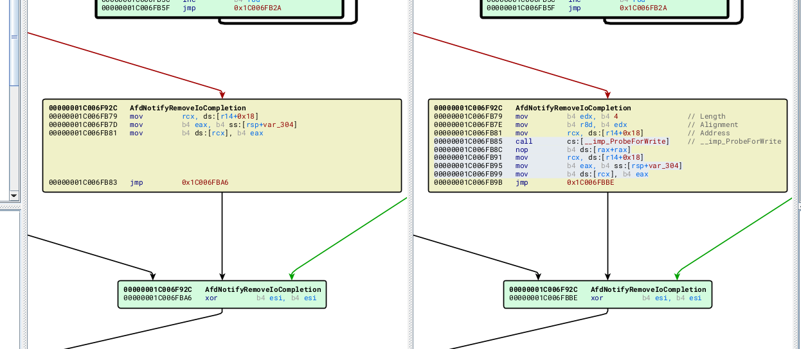
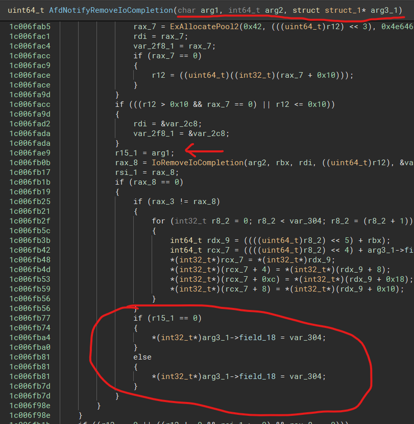
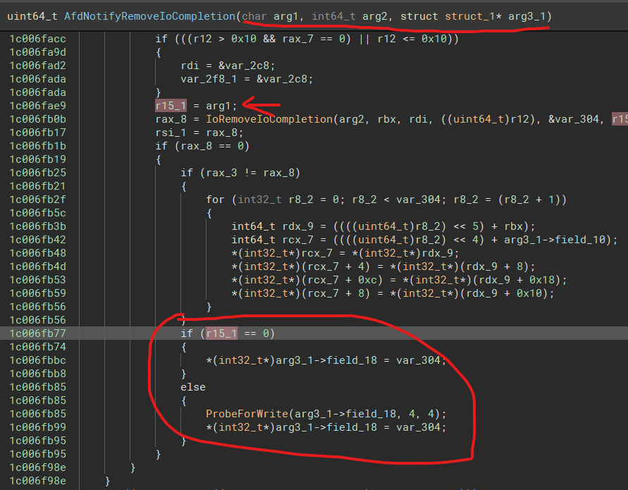
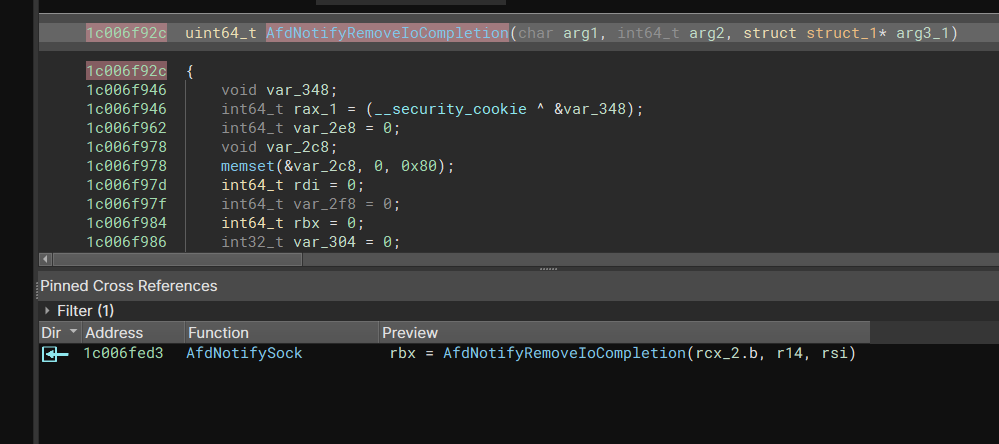
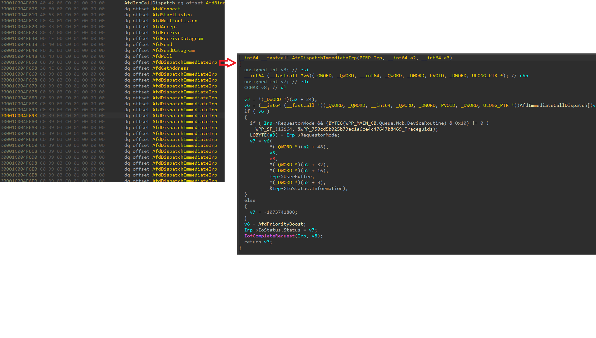
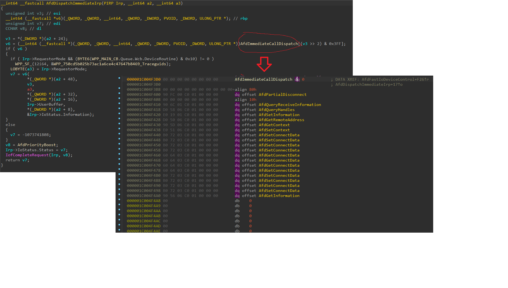
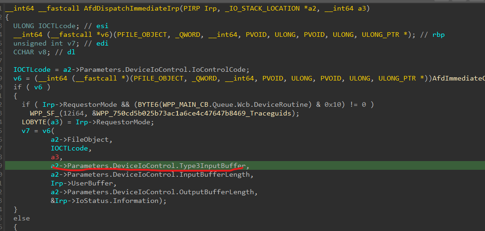
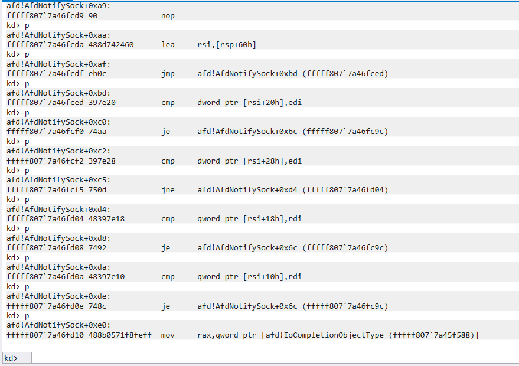
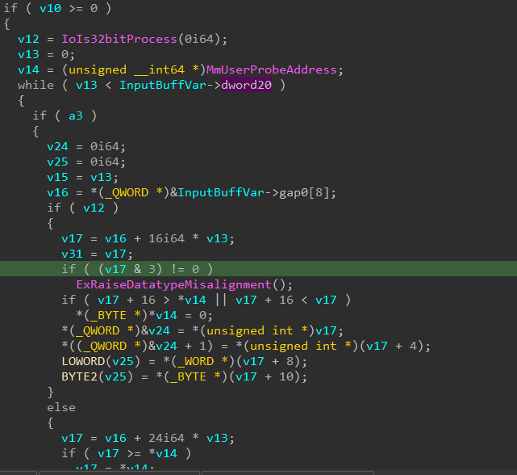
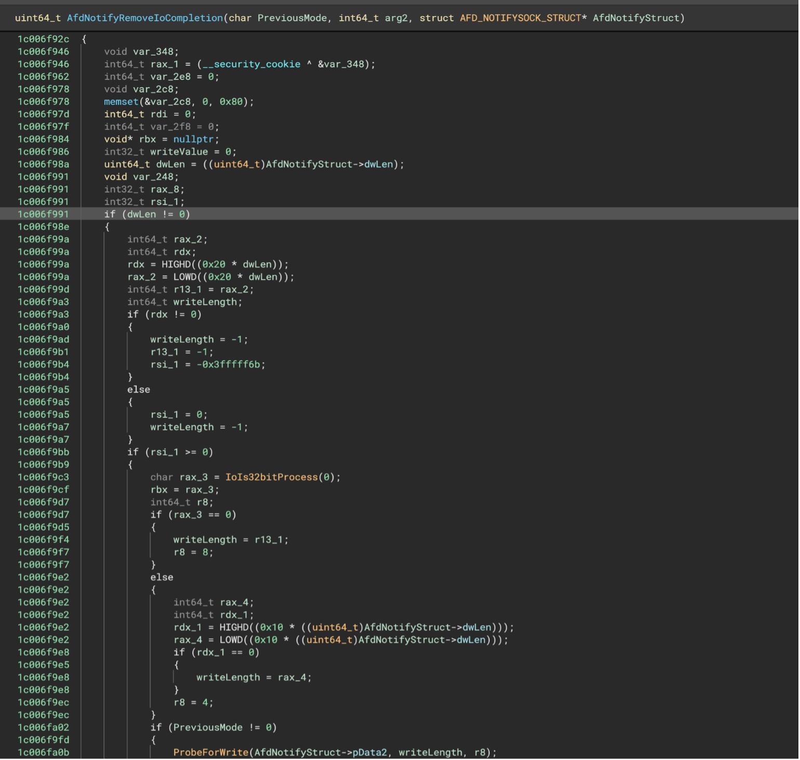

# CVE-2023-21768

## Windows Ancillary Function Driver for WinSock

Theo mô tả chi tiết của CVE-2023-21768 công bố bởi Microsoft Security Response Center (MSRC), lỗ hổng tồn tại trong `Ancillary Function Driver (AFD)`, có tên tệp trong hệ thống là `afd.sys`. `AFD` module là kernel entry point của `WinSock API`. Trong bài phân tích này mình sẽ sử dụng nó để khai thác leo thang đặc quyền trên windows 11.

## Patch Diff and Root Cause Analysis

Tải về 2 phiên bản của `afd.sys` từ `Winbindex`, một phiên bản gần nhất trước khi được vá, và một phiên bản sau khi được vá. Sau đó sử dụng `Bindiff` để so sánh 2 phiên bản này.


So sánh tổng quan 2 version, ta thấy chỉ duy nhất 1 hàm có sự khác biệt là `AfdNotifyRemoveIoCompletion`. Xem chi tiết hơn về sự khác biệt của hàm này giữa 2 phiên bản.


Không có quá nhiều sự khác biệt giữa hai phiên bản. Ở phiên bản post-patch, có thêm các lệnh assembly để set các tham số và gọi hàm `ProbeForWrite`. Theo [document](https://learn.microsoft.com/en-us/windows-hardware/drivers/ddi/wdm/nf-wdm-probeforwrite) của Microsoft thì hàm này dùng để kiểm tra một địa chỉ xem nó có thực sự thuộc user-mode, có quyền write, và được aligned một cách chính xác hay không. Phân tích chi tiết hơn đoạn code này:

- pre-patch `afd.sys version 10.0.22621.608`


-post-patch `afd.sys version 10.0.22621.1105`


cả hai đều kiểm tra giá trị của `r15_1`, nếu bằng `0` ghi giá trị của `var_304` vào con trỏ được chỉ định tại một field của `struct_1`. Nếu khác `0`, `ProbeForWrite` sẽ được gọi để chắc chắn con trỏ trỏ tới địa chỉ hợp lệ. Tại version `pre-patch` sau đó mới ghi giá trị tại `var_304` vào con trỏ, đoạn check này bị thiếu. Từ bản vá này, ta có thể đoán được rằng chúng ta có thể gọi tới đoạn code này với giá trị của `arg3_1->field_18` được kiểm soát. Nếu có thể set một giá trị địa chỉ kernel tại `field_18` thì ta có thể ghi `var_304` vào địa chỉ vùng nhớ kernel.

=> bug type: **arbitrary kernel Write-Where**

Bây giờ cần tìm cách trigger được bug. Hàm `AfdNotifyRemoveIoCompletion` được gọi trực tiếp trong hàm `AfdNotifySock`.


Tương tự, tìm cross reference của `AfdNotifySock` ta thấy nó không được gọi trực tiếp từ hàm nào khác, nhưng địa chỉ hàm được lưu tại một địa chỉ tại `.rdata`


địa chỉ này nằm ngay trước `AfdIrpCallDispatch`.


Để trigger được bug, mình sẽ gọi `DeviceIoControl` với `IOCTL_AFD_NOTIFY_SOCK` và `AfdNotifySock` sẽ được gọi.

```C
BOOL DeviceIoControl(
  [in]                HANDLE       hDevice,
  [in]                DWORD        dwIoControlCode,
  [in, optional]      LPVOID       lpInBuffer,
  [in]                DWORD        nInBufferSize,
  [out, optional]     LPVOID       lpOutBuffer,
  [in]                DWORD        nOutBufferSize,
  [out, optional]     LPDWORD      lpBytesReturned,
  [in, out, optional] LPOVERLAPPED lpOverlapped
);
```

### reverse and debug

Với mỗi driver, sẽ có một `DRIVER_OBJECT` object được tạo ra trong kernel, nó được định nghĩa như sau:

```C
typedef struct _DRIVER_OBJECT {
  CSHORT             Type;
  CSHORT             Size;
  PDEVICE_OBJECT     DeviceObject;
  ULONG              Flags;
  PVOID              DriverStart;
  ULONG              DriverSize;
  PVOID              DriverSection;
  PDRIVER_EXTENSION  DriverExtension;
  UNICODE_STRING     DriverName;
  PUNICODE_STRING    HardwareDatabase;
  PFAST_IO_DISPATCH  FastIoDispatch;
  PDRIVER_INITIALIZE DriverInit;
  PDRIVER_STARTIO    DriverStartIo;
  PDRIVER_UNLOAD     DriverUnload;
  PDRIVER_DISPATCH   MajorFunction[IRP_MJ_MAXIMUM_FUNCTION + 1];
} DRIVER_OBJECT, *PDRIVER_OBJECT;
```

Thành phần cuối cùng `MajorFunction` là một mảng chứa các hàm dispatch của driver để xử lý các giao tiếp giữa kernel và usermode. Dispatch function tương ứng với việc gọi `DeviceIoControl` được lưu tại `MajorFunction[IRP_MJ_DEVICE_CONTROL]`.

```c
#define IRP_MJ_DEVICE_CONTROL           0x0e
```

Từ hàm `DriverEntry` của afd.sys, chúng ta có thể thấy rằng trình điều khiển đã tạo device object "\\Device\\Afd":


Gán `MajorFunction[IRP_MJ_DEVICE_CONTROL]` = `AfdDispatchDeviceControl`, vì vậy khi gọi `DeviceIoControl` để giao tiếp với kernel, nó sẽ gọi hàm này.


Trong `AFD` có 2 dispatch table là `AfdIrpCallDispatch` và `AfdImmediateCallDispatch`.



Có thể dễ dàng thấy rằng`AfdDispatchDeviceIoControl` tính toán subscript thông qua IoControlCode và lấy giá trị tương ứng với subscript từ AfdIoctlTable để xác minh bằng IoControlCode.


Từ khoảng cách giữa địa chỉ bắt đầu của `AfdImmediateCallDispatch` và địa chỉ lưu `AfdNotifySock`, ta tính được index là 73, có control code là `0x12127`


```c
int main() {
    WSADATA WSAData;
    SOCKET s;
    SOCKADDR_IN sa;
    int ierr;

    WSAStartup(0x2, &WSAData);
    s = socket(AF_INET, SOCK_STREAM, IPPROTO_TCP);
    memset(&sa, 0, sizeof(sa));
    sa.sin_port = htons(135);
    sa.sin_addr.S_un.S_addr = inet_addr("127.0.0.1");
    sa.sin_family = AF_INET;
    ierr = connect(s, (const struct sockaddr*)&sa, sizeof(sa));

    char outBuf[100];
    DWORD bytesRet;
    DWORD inbuf1[100];

    memset(inbuf1, 0, sizeof(inbuf1));

    DeviceIoControl((HANDLE)s, 0x12127, (LPVOID)inbuf1, 0x30, outBuf, 0, &bytesRet, NULL);
    return 0;
}
```

it works!


Như đã nói từ đầu, lỗ hổng xảy ra khi ta có thể truyền vào một unvalidated pointer thông qua một struct. Struct này được truyền trực tiếp từ usermode thông qua `lpInBuffer` của `DeviceIoControl`. Sau đó truyền vào `AfdNotifySock` tương ứng với parameter thứ 4 và truyền vào `AfdNotifyRemoveIoCompletion` tương ứng với parameter thứ 3.




Vì chưa biết struct gồm những gì nên mình để IDA tự tạo struct. Bây giờ cần tìm cách để truyền dữ liệu vào struct này và bypass những check cần thiết đễ đễ được đoạn code lỗi. Bắt đầu từ hàm `AfdNotifySock`:


Đầu tiên size của struct cần phải bằng 0x30 bytes.


các giá trị cần khác 0:


Một điều nữa là khi debug thì mình thấy nó nhảy về fail tại đoạn check UserBuffer trước đó, vì vậy nên khi gọi `DeviceIoControl` giá trị này set thành NULL. Sau khi set các giá trị trên thì mình đã qua được sau đoạn check2.




Check tiếp theo cần bypass:


`ObReferenceObjectByHandle` phải return `STATUS_SUCCESS` thì mới qua được đoạn check này. Tức là mình phải truyền vào một handle hợp lệ. Mình thử tìm thì không thấy có chỗ nào nói về cách tạo `IoCompletionObjectType`. Nên mình đã là theo bài phân tích [https://securityintelligence.com/posts/patch-tuesday-exploit-wednesday-pwning-windows-ancillary-function-driver-winsock/](https://securityintelligence.com/posts/patch-tuesday-exploit-wednesday-pwning-windows-ancillary-function-driver-winsock/). Sử dụng hàm [`NtCreateIoCompletion`](http://undocumented.ntinternals.net/index.html?page=UserMode%2FUndocumented%20Functions%2FNT%20Objects%2FIoCompletion%2FNtCreateIoCompletion.html) để tạo một `IoCompletionObjectType` và truyền vào `ObReferenceObjectByHandle` handle của nó.
Sau khi bypass được check này thì flow của chương trình nhảy vào một vòng lặp, trong vòng lặp này không có chỗ nào làm chuyển sang flow fail nên mình đơn giản set giá trị tại `dword20` thành 0x1 để thoát khỏi vòng lặp.



Sau khi ra khỏi vòng lặp thì chương trình sẽ gọi đến `AfdNotifyRemoveIoCompletion`. Tiếp tục phân tích với hàm `AfdNotifyRemoveIoCompletion`:



Đầu tiên chương trình check 1 field khác của struct, nó phải khác 0. Sau đó được nhân với 0x20, rồi được dùng làm parameter để gọi hàm `ProbeForWrite` cùng với một field khác của struct. Ở đây chỉ cần dùng một địa chỉ thuộc vùng nhớ user-mode có quyền write và dwLen = 1 là được. Check cuối cùng trước khi ta có thể trigger lỗi là giá trị trả về khi gọi hàm `IoRemoveCompletion` phải là `STATUS_SUCCESS`. Sau khi thử tìm kiếm thì mình biết được là hàm `NtRemoveIoCompletion` sau khi được gọi sẽ gọi đến hàm `IoRemoveCompletion`. Theo [document](http://undocumented.ntinternals.net/index.html?page=UserMode%2FUndocumented%20Functions%2FNT%20Objects%2FIoCompletion%2FNtSetIoCompletion.html) này thì hàm `NtRemoveIoCompletion` có chức năng là một "waiting call" và sẽ kết thúc khi có ít nhất một ít nhất một record hoàn thành trong một `Io Completion Object` chỉ định. Record được thêm khi quá trình I/O hoàn thành.

```C
NtRemoveIoCompletion(
  IN HANDLE               IoCompletionHandle,
  OUT PULONG              CompletionKey,
  OUT PULONG              CompletionValue,
  OUT PIO_STATUS_BLOCK    IoStatusBlock,
  IN PLARGE_INTEGER       Timeout OPTIONAL );
```

ngoài ra có một tham số optional khác là `Timeout`, khi đạt giá trị timeout thì hàm sẽ kết thúc. Tuy nhiên chỉ set timeout = 0 là không đủ để hàm trả về return, mà sẽ trả về timeout error code. Chúng ta có thể dùng hàm [`NtSetIoCompletion`](http://undocumented.ntinternals.net/index.html?page=UserMode%2FUndocumented%20Functions%2FNT%20Objects%2FIoCompletion%2FNtSetIoCompletion.html) để tăng biến đếm các IO đang chờ xử lý trong `IoCompletionObjectType` lên 1 và kêt thúc hàm `NtRemoveIoCompletion` trước khi timeout. Sau khi thử nhiều lần, mình thấy giá trị được ghi luôn = 0x1.

## exploit - LPE with IORING

Với việc có thể ghi giá trị 0x1 vào một địa chỉ kernel-mode, ta có thể dùng lỗi này để có đầy đủ khả năng đọc/ghi địa chỉ tùy ý bằng cách tận dụng I/O ring(một cơ chế I/O mới được Microsoft cho ra mắt). `Yarden Shafir` đã viết một bài phân tích rất chi tiết về cách này, bạn có thể đọc [tại đây](https://windows-internals.com/one-i-o-ring-to-rule-them-all-a-full-read-write-exploit-primitive-on-windows-11/). Một trong những thao tác mà ứng dụng có thể thực hiện là allocate tất cả các bộ đệm cho các thao tác I/O trong tương lai của nó, sau đó đăng kí chúng với I/O ring. Các bộ đệm đăng ký trước được tham chiếu thông qua I/O object:

```C
typedef struct _IORING_OBJECT
{
    USHORT Type;
    USHORT Size;
    NT_IORING_INFO UserInfo;
    PVOID Section;
    PNT_IORING_SUBMISSION_QUEUE SubmissionQueue;
    PMDL CompletionQueueMdl;
    PNT_IORING_COMPLETION_QUEUE CompletionQueue;
    ULONG64 ViewSize;
    ULONG InSubmit;
    ULONG64 CompletionLock;
    ULONG64 SubmitCount;
    ULONG64 CompletionCount;
    ULONG64 CompletionWaitUntil;
    KEVENT CompletionEvent;
    UCHAR SignalCompletionEvent;
    PKEVENT CompletionUserEvent;
    ULONG RegBuffersCount;
    PVOID RegBuffers;
    ULONG RegFilesCount;
    PVOID* RegFiles;
} IORING_OBJECT, *PIORING_OBJECT;
```

Nếu lỗ hổng bảo mật, chẳng hạn như lỗ hổng được đề cập trong bài này, cho phép bạn cập nhật/chỉnh sửa các trường `RegBuffersCount` và `RegBuffers`, thì có thể sử dụng API I/O ring tiêu chuẩn để đọc và ghi bộ kernel. Tuy nhiên với việc sử dụng hàm `NtQuerySystemInformation` thì yêu cầu cần có `Medium IL` privilege. Để LPE từ `Low IL` thì cần có một cách nào đó để leak được địa chỉ kernel.

Sau khi IoRing->RegBuffers trỏ đến fakeBuffer, do người dùng kiểm soát, chúng ta có thể sử dụng các I/O ring operation thông thường để tạo đọc và ghi vào bất kỳ địa chỉ nào chúng ta muốn bằng cách chỉ định một index vào fake để sử dụng làm buffer:

- Read operation + kernel address: kernel sẽ “đọc” từ một tệp mà chúng ta chọn vào địa chỉ kernel đã chỉ định, dẫn đến việc ghi tùy ý.
- Write operation + kernel address: kernel sẽ “ghi” dữ liệu trong địa chỉ đã chỉ định vào một tệp do chúng ta chọn, dẫn đến việc đọc tùy ý.

Để hiểu rõ hơn bạn có thể đọc bài phân tích của `Yarden Shafir` ở link bên trên.

### issue

Sau khi thử tạo IO Ring object và write bằng poc code phía trên thì windows bị crash sau khi gọi `DeviceIOControl` /_ \ nên mình dùng cách [gọi thẳng tới các hàm Ntfunction](https://www.x86matthew.com/view_post?id=ntsockets) (˘･_･˘)

## Affect range

- windows 11 21H1/22H2 trước os build 22000.1455/22621.1105
- windows server 2022 trước os build 20348.1487

## The patch

- Bản vá đã thêm đoạn code gọi `ProbeForWrite`
- phiên bản vá:
    - windows 11 21H1: KB5022287 (OS Build 22000.1455)
    - windows 11 22H2: KB5022303 (OS Build 22621.1105)
    - windows server 2022: KB5022291 (OS Build 20348.1487)

## [POC](https://www.youtube.com/watch?v=hklVAE3y84o&ab_channel=B%C3%A1Nguy%E1%BB%85n)
